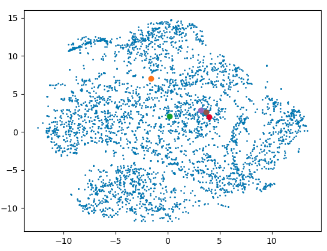
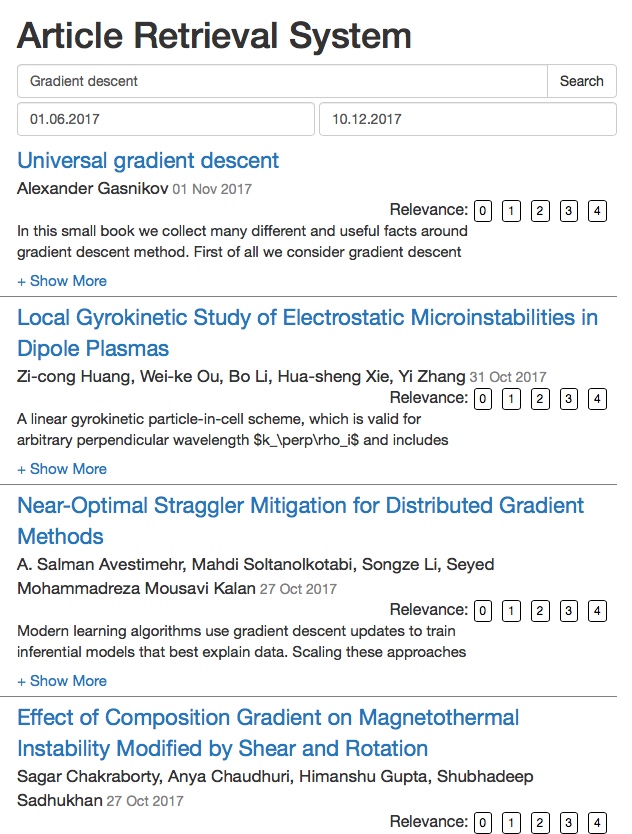
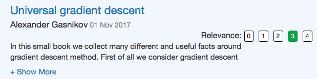

# Article retrieval system
Read our [report](https://github.com/rebryk/SPbAU-IR/blob/master/report/report.pdf).

## Installation
Python 3 is required.

```
pip3 install -r requirements.txt
python -m nltk.downloader popular
```

## Content

### Crawling
You should modify two configuration files to crawl websites:
* `config/crawler.json` stores crawling settings, such as `user_agent`, `max_depth` etc.
* `config/hosts.json` contains websites for crawling.

Example of `crawler.json`
```
{
  "user_agent": "crawler-bot",
  "max_pages_count": 100000,
  "max_depth": 10,
  "delay": 50,
  "frontier_dump_delay_s": 600
}
```

Example of `hosts.json`
```
{
  "hosts": [
    "https://arxiv.org/",
    "https://www.springer.com",
    "https://link.springer.com"
  ]
}
```

To start crawling please run `python3 main.py crawler` <br>
All downloaded pages are in `webdata/` folder.

### Parsing
After crawling, you need to parse downloaded data. <br>
You have to run `python3 main.py parser` to do it. <br>
Currenlty we support parsers for [arxiv.org](arxiv.org) and [springer.com](springer.com).

### Indexing
#### Page attribute file
For each article, we store its attributes: `title`, `abstract`, `processed abstract`, `number of words`, `the link to pdf` and so on.

#### Inverted index
We build an inverted index. For each word, we store a list with documents that contain this word. And for each document, we store the number of occurrences of this word in the document with positions of these occurrences. The document lists are sorted by the number of occurrences.

To start indexing run `python3 main.py index`

### Article similarity graph
We associate each article with a point on 2D plane. The expected property of these points is that we want close points correspond to the “similar” articles. By the similarity of the articles we mean that they have similar meaning, common theme etc.
To measure “similarity” of articles we’re using `gensim’s` `doc2vec` model. Each article is associated with a multidimensional vector which has been trained using this model. Then, we reduce dimension of those vectors to 2 using `t-SNE`.
The problem is that for the majority of search queries the top 5 articles are not located close to each other. Most likely this problem can be solved by obtaining larger dataset of articles and by tuning `doc2vec’s` hyperparameters.
However, for some queries results are pretty nice:


Please, run `python3 main.py doc2vec` to train the `doc2vec` model.

### Web UI
Finally, you can spin up a server with web UI by running `python3 main.py web`


### Online evaluation
We added an additional bar with buttons for each retrieved document. So users can use these buttons to mark how relevant the given document is.



## License
[MIT](LICENSE)
